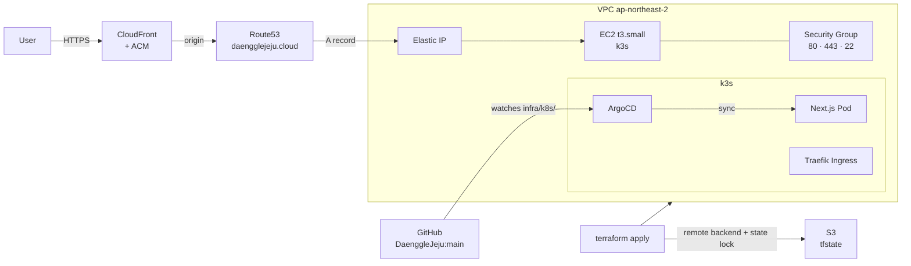

# daengglejeju-infra

> Terraform IaC for DaenggleJeju — single-command provisioning of the full AWS stack, plus ArgoCD GitOps manifests.


---

## Architecture



---

## Stack

| Layer | Technology |
|---|---|
| IaC | Terraform |
| Compute | AWS EC2 t3.small (k3s single node) |
| CDN / TLS | CloudFront + ACM (us-east-1) |
| DNS | Route53 |
| State | S3 Remote Backend + native state locking |
| Container runtime | k3s (lightweight Kubernetes) |
| Ingress | Traefik Ingress Controller |
| GitOps | ArgoCD |

---

## Prerequisites

- [Terraform](https://developer.hashicorp.com/terraform/install) ≥ 1.10
- AWS CLI configured (`aws configure`) with sufficient IAM permissions
- S3 bucket `daengglejeju-tfstate` already created (bootstrap once, not managed here)

---

## Quick Start

```bash
# 1. Initialize — downloads providers, connects to S3 backend
terraform init

# 2. Preview changes
terraform plan -var="ssh_public_key=$(cat ~/.ssh/id_ed25519.pub)"

# 3. Apply
terraform apply -var="ssh_public_key=$(cat ~/.ssh/id_ed25519.pub)"
```

Or use a `terraform.tfvars` file (excluded from git):

```hcl
# terraform.tfvars
ssh_public_key = "ssh-ed25519 AAAA..."
```

```bash
terraform apply
```

---

## Variables

| Name | Type | Default | Description |
|---|---|---|---|
| `aws_region` | string | `ap-northeast-2` | AWS region |
| `project` | string | `daengglejeju` | Resource name prefix |
| `domain` | string | `daengglejeju.cloud` | Service domain |
| `ec2_instance_type` | string | `t3.small` | k3s node instance type |
| `ec2_ami` | string | Ubuntu 24.04 LTS | AMI ID (ap-northeast-2) |
| `ssh_public_key` | string | — | **Required.** EC2 SSH public key |

---

## Outputs

| Name | Description |
|---|---|
| `ec2_public_ip` | k3s node Elastic IP |
| `cloudfront_domain` | CloudFront distribution domain |
| `cloudfront_id` | CloudFront distribution ID |
| `route53_nameservers` | NS records — point your registrar here |

---

## Resource Inventory

| Resource | Description |
|---|---|
| `aws_vpc` | /16 VPC |
| `aws_subnet` | Single public subnet |
| `aws_internet_gateway` + `aws_route_table` | Public internet access |
| `aws_security_group` | Ingress 80/443/22, egress all |
| `aws_instance` | t3.small, Ubuntu 24.04 |
| `aws_eip` | Static public IP attached to EC2 |
| `aws_acm_certificate` (us-east-1) | TLS cert for CloudFront |
| `aws_cloudfront_distribution` | CDN, HTTPS redirect, custom domain |
| `aws_route53_zone` + records | Hosted zone, apex/www A records, ACM CNAME |
| `aws_key_pair` | EC2 SSH key |

---

## State Management

Remote state is stored in S3 with native locking (`use_lockfile = true`). No DynamoDB table required.

```
s3://daengglejeju-tfstate/prod/terraform.tfstate
```

If a lock is stuck after an interrupted apply:

```bash
terraform force-unlock <LOCK_ID>
```

---

## ArgoCD

ArgoCD manifests live in `argocd/`.

| File | Description |
|---|---|
| `application.yaml` | ArgoCD Application — watches `DaenggleJeju:main` `infra/k8s/`, automated sync + selfHeal + prune |
| `ingress.yaml` | Traefik Ingress for ArgoCD UI (`argocd.daengglejeju.cloud`) |
| `install.sh` | One-time bootstrap script — installs ArgoCD and registers the Application |

### Bootstrap (run once on the k3s node)

```bash
bash argocd/install.sh
```

This creates the `argocd` namespace, installs ArgoCD, patches the server to run without its own TLS (Traefik handles it), and applies the Ingress + Application manifests.

### Deployment flow

```
develop push
  → GitHub Actions: build image + push to GHCR + update infra/k8s/deployment.yaml image tag
  → PR: develop → main
  → merge
  → ArgoCD detects manifest diff → auto-sync to k3s
```

---

## What's Not Here

Application source code and CI workflows live in [`DaenggleJeju`](https://github.com/kweonsikyung/DaenggleJeju).

- **Monitoring**: Prometheus + Grafana stack (planned)
